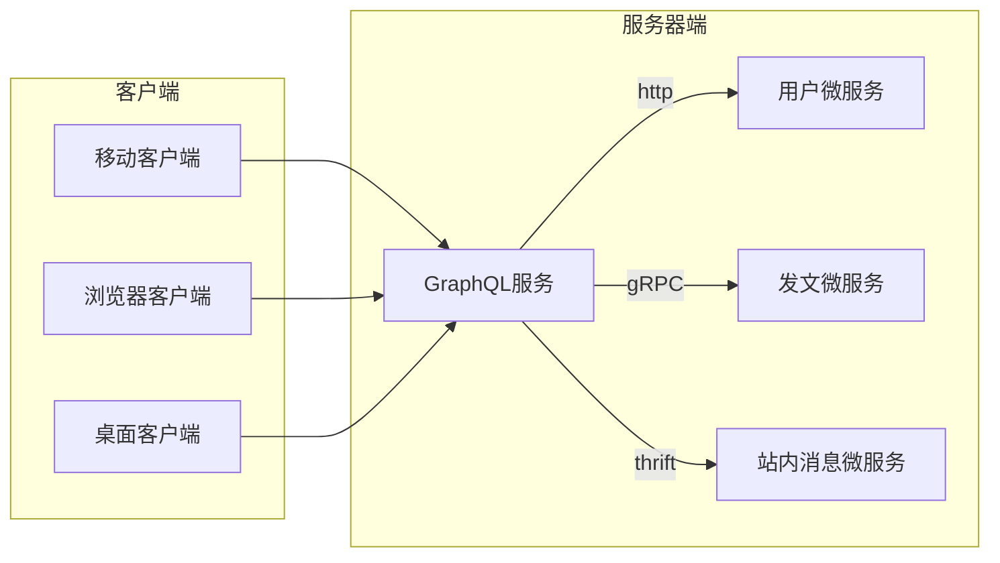
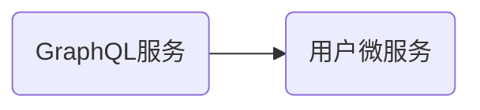
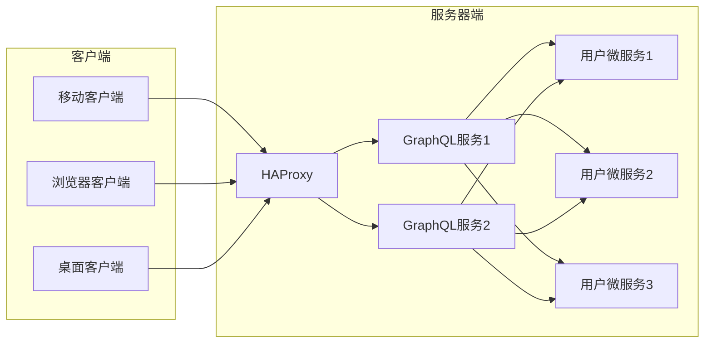

# 微服务网关原型

## 系统设计

### 系统架构图 -- naïve
方案：利用GraphQL的天然数据聚合能力实现微服务网关

- [X] 统一入口
- [X] 协议转换
- [ ] 这样的架构就是微服务网关吗？
- [ ] 如果这样做微服务网关会有什么问题？

* 任务1: 如何水平扩展以及消除单点故障
* 任务2: 如何追踪请求


### 基本原型

我们通过验证下面的基本原型来找到系统设计中的问题。


##### 环境准备

1. 安装GraphQL工具包
这里要注意$GOPATH/bin要在系统PATH中
`go get github.com/beinan/gql-server`

1. Clone模版项目
```zsh
$ git clone https://github.com/beinan/gql-server-examples
$ cd gql-server-examples
$ git fetch
$ git checkout clean-starter
```

##### 本地启动服务

1. 启动用户微服务
```zsh
cd user-service  
go run .
```
1. 启动微服务网关
```zsh
cd gateway 
go run .
```


#### 请求/响应序列图

网关与微服务之间的相应时序

```sequence
客户端->GraphQL网关: GraphQL请求
GraphQL网关->用户服务: HTTP GET /user/1
用户服务-->GraphQL网关: Json: {id:"1", name:"User_1"}
GraphQL网关->用户服务: HTTP GET /user/2
用户服务-->GraphQL网关: Json: {id:"2", name:"User_2"}
GraphQL网关-->客户端: GraphQL数据 
```
- [ ] 微服务网关如何找到用户微服务？ 
- [ ] 用户微服务如何进行水平扩展？
- [ ] 微服务网关如何进行水平扩展？
- [ ] 如何让这个架构具备基本的容错功能？

## 基于docker-compose的开发环境搭建

### GraphQL网关的docker image配置
我们在gateway目录下创建Dockerfile
```
FROM golang:1.11

ADD . /go/src/github.com/beinan/gql-server-examples/
WORKDIR /go/src/github.com/beinan/gql-server-examples/gateway

RUN go get github.com/canthefason/go-watcher
RUN go install github.com/canthefason/go-watcher/cmd/watcher

RUN go build
RUN go install

CMD watcher -run github.com/beinan/gql-server-examples/gateway -watch github.com/beinan/gql-server-examples/gateway
```

创建了Dockerfile之后，我们要在gateway目录下运行
```zsh
$ docker build . -t graphql/gateway:0.1
```
参考：https://docs.docker.com/engine/reference/commandline/build/

### 添加GraphQL网关到docker-compose
在项目根目录下创建docker-compose.yml
```yml
version: '3.3'
services:
  gateway:
    build: ./gateway
    image: beinan/gateway:devel
    ports:
     - "8888:8888"
    links:
     - user-service
    volumes:
     - ./gateway:/go/src/github.com/beinan/gql-server-examples/gateway
```

### 为用户微服务创建Docker容器配置文件

```zsh
FROM golang:1.11

ADD . /go/src/github.com/beinan/gql-server-examples/user-service
WORKDIR /go/src/github.com/beinan/gql-server-examples/user-service

RUN go get github.com/canthefason/go-watcher
RUN go install github.com/canthefason/go-watcher/cmd/watcher

RUN go build
RUN go install

CMD watcher -run github.com/beinan/gql-server-examples/user-service -watch github.com/beinan/gql-server-examples/user-service

```

### 添加用户微服务到docker-compose

```yml
  user-service:
    build: ./user-service
    image: beinan/user-service:devel
    ports:
     - "9090"
    volumes:
     - ./user-service:/go/src/github.com/beinan/gql-server-examples/user-service
```

## 水平扩展我们的网关和微服务

### 使用docker-compse的--scale参数
- [ ] 水平扩展内部微服务
- [ ] 水平扩展网关
- [ ] 负载均衡

### 使用HAProxy的负载均衡

#####系统架构图

#### docker-compose配置

```yml
  lb:
    image: 'dockercloud/haproxy:latest'
    links:
     - gateway
    volumes:
      - /var/run/docker.sock:/var/run/docker.sock
    ports:
     - '8080:80'
```

## 接下来的任务

* HAProxy是如何发现我们的网关服务的？
* 如何在分布式系统中追踪我们的请求？
* 如何负载均衡对用户微服务的访问？
* 如何解决HAProxy的单点故障问题？